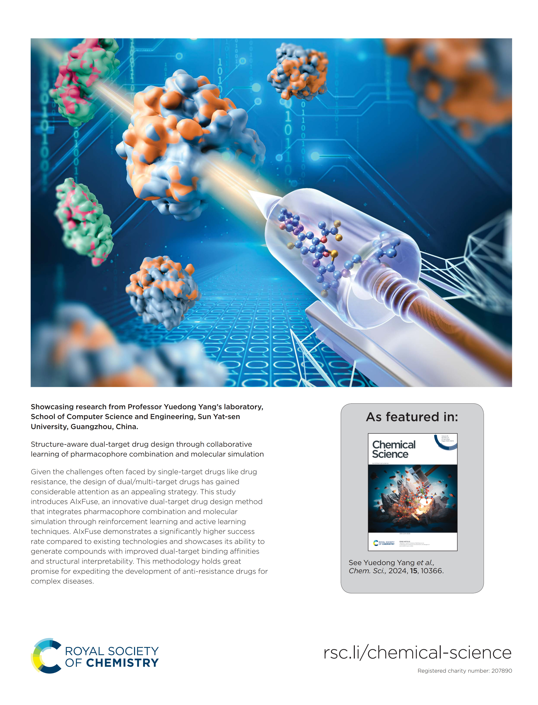

# AIxFuse
Our paper published as a back cover article in Chemical Science:    
[Structure-aware dual-target drug design through collaborative learning of pharmacophore combination and molecular simulation](https://doi.org/10.1039/D4SC00094C)

## Environment
`conda env create -f env.yml`   
, then run `conda activate aixfuse`    
**DGLlife with pytorch:**    
`pip3 install  dgl -f https://data.dgl.ai/wheels/torch-2.4/cu121/repo.html`    
, or refer to [DGL official](https://www.dgl.ai/pages/start.html) to specify your cuda version et al.   
, then run `pip3 install  dgllife`   
**PLIP**:   
`apt install libopenbabel-dev`    
`pip3 install openbabel`    
, if error occurs like `Error: SWIG failed. Is Open Babel installed?`:    
* run `apt install swig`    
* if it still fail, refer to [openbabel issue](https://github.com/openbabel/openbabel/issues/2408)   

, then run `pip3 install plip`    
**MOSES:**   
`pip3 install molsets`     
, if error occurs like `ERROR: Failed building wheel for pomegranate`:    
* run `git clone git@github.com:molecularsets/moses.git`    
* , then run `cd moses`    
* , then run `python setup.py install`    

## Download Data (too large for github)
Contact [My Email](chensh88@mail2.sysu.edu.cn)
## Pharmacophore Extraction
Run `pharmacophore_extr.ipynb`
## Generate Molecules by Our Final Agent
`python iter_gen.py --task rorgt_dhodh --iter 4 --single_process --generate --schrodinger_dir xx --ligpre_path xx --glide_path xx`   
, leave `schrodinger_dir, ligpre_path, glide_path` as `xx`, here we don't need those software. 
## Generate Molecules from Scratch
Make sure that you have schrodinger, ligpre, and glide at `your_schrodinger_dir`, `your_ligpre_path`, and `your_glide_path`.   
We run glide on a distributed system. If you don't run it this way, please modify `utils/ligpre.py` and `utils/docking.py`.   
, then you can run:   
`python iter_gen.py --task rorgt_dhodh --schrodinger_dir your_schrodinger_dir --ligpre_path your_ligpre_path --glide_path your_glide_path`   
